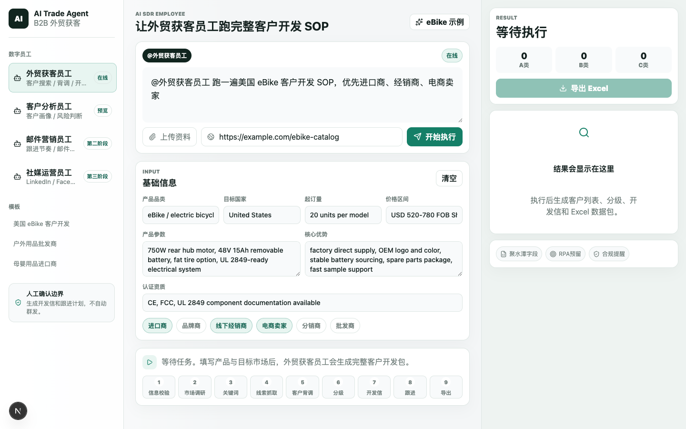

# AI Trade Agent - AI外贸客户开发SOP智能体

> Commercial use: this repository is published for portfolio/demo evaluation. Commercial use or resale requires written permission. See `COMMERCIAL_USE.md`.

## Screenshot



这是第一阶段 MVP：`AI外贸获客数字员工`。产品形态是对话 + 数字员工，第一栏选择员工，下指令时用 `@外贸获客员工`，系统按 9 步 SOP 自动生成海外客户开发包。

## 已实现的9步SOP

1. 基础信息录入与缺项校验
2. AI 目标市场调研
3. Google / LinkedIn 关键词库生成
4. 潜客线索抓取与 B2B 清洗
5. 客户官网背调与画像
6. A/B/C 客户意向分级
7. 三套英文开发信生成
8. 30 天 7 次跟进 SOP
9. Excel `.xlsx` 数据包导出

内置 `eBike 美国市场` 示例，进入页面后可直接点击“开始执行 SOP”测试完整流程。

## 模块调用逻辑

- 前端入口：`src/components/demo-workspace.tsx`
- SOP API：`POST /api/sdr/run`
- Excel 导出 API：`POST /api/sdr/export`
- SOP 引擎：`src/lib/sdr-sop-engine.ts`
- 底层线索搜索：`src/lib/lead-engine.ts` 和 `src/lib/search-providers.ts`
- 开发信生成接口：`POST /api/content/generate`

Excel 文件包含 6 个工作表：客户线索清单、关键词库、客户背调档案、开发信合集、30天跟进SOP、市场分析与合规。

当前内置品类模板：eBike、家居/家具、母婴、户外。其他品类会走通用 B2B 外贸模板。

默认 `SEARCH_PROVIDER=mock`，无需 API Key 也能跑通完整 SOP。设置 `AI_PROVIDER=openai` 并填写 `OPENAI_API_KEY` 后，开发信接口会尝试调用 OpenAI Responses API；失败时自动回退到本地模板。

## 测试真实获客效果

默认 `SEARCH_PROVIDER=mock` 会生成演示客户。要测试真实公开搜索效果：

1. 创建 Google Programmable Search Engine，拿到 `GOOGLE_CUSTOM_SEARCH_CX`
2. 创建 Google Custom Search JSON API Key，填入 `GOOGLE_CUSTOM_SEARCH_KEY`
3. 在 `.env.local` 中设置：

```bash
SEARCH_PROVIDER=google-cse
GOOGLE_CUSTOM_SEARCH_KEY=你的key
GOOGLE_CUSTOM_SEARCH_CX=你的cx
```

然后输入类似 `@外贸获客员工 帮我找德国做电子烟的批发商客户`。系统会用 Google Custom Search 搜索公开网页，抓取官网首页，尝试提取邮箱/电话，并生成客户评分。邮箱默认为待复核，不会自动发送。

Google 搜索引擎建议设置为搜索整个 Web，否则结果会被限制在你创建搜索引擎时填写的网站范围内。

## 本地运行

```bash
npm install
cp .env.example .env.local
npm run dev -- --hostname 127.0.0.1 --port 3002
```

打开 `http://127.0.0.1:3002`。

## 常用命令

```bash
npm test
npm run build
```

## 后续预留接口

- RPA：可在 `SdrSopResult.planRows` 后接自动建任务、自动填表。
- 聚水潭 ERP：当前 Excel 字段已对齐“客户公司名、官网、邮箱、主营品类、意向等级、核心匹配点、开发信内容、首次发送时间、下次跟进日期”。
- TikTok Shop / Facebook / LinkedIn 数据源：在 `search-providers.ts` 新增 provider 后复用同一套 SOP 引擎。

## 部署

完整小白步骤见 [docs/VERCEL_DEPLOYMENT_GUIDE.md](docs/VERCEL_DEPLOYMENT_GUIDE.md)。

## Private Deployment / Customization

For private deployment, B2B lead-generation workflow customization, data-source integration, or sales automation consulting, scan WeChat to contact me.


